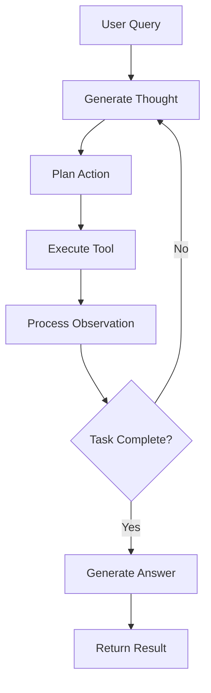

# 🤖 AI Agents Module

[](https://www.python.org/)
[](https://react-lm.github.io/)
[](https://mistral.ai/)

> Intelligent agent implementations featuring the ReAct (Reasoning and Acting) pattern for autonomous task completion with step-by-step reasoning.

## 📋 Table of Contents

- [Overview](#-overview)
- [ReAct Agent Architecture](#-react-agent-architecture)
- [Implementation Details](#-implementation-details)
- [Tools System](#-tools-system)
- [LLM Integration](#-llm-integration)
- [Usage Examples](#-usage-examples)
- [Extending the Agent](#-extending-the-agent)

## 🎯 Overview

The agents module implements sophisticated AI agents capable of:
- **Reasoning**: Analyzing tasks and planning approaches
- **Acting**: Executing tools to accomplish goals
- **Observing**: Processing results and adjusting strategies
- **Learning**: Adapting behavior based on observations

## 🧠 ReAct Agent Architecture

### Core Components

```
┌─────────────┐     ┌─────────────┐     ┌─────────────┐
│   THOUGHT   │────▶│   ACTION    │────▶│ OBSERVATION │
└─────────────┘     └─────────────┘     └─────────────┘
       ▲                                         │
       └─────────────────────────────────────────┘
                    Feedback Loop
```

### Step Types

| Step | Description | Example |
|------|-------------|---------|
| **Thought** | Reasoning about the task | "I need to add a new todo item" |
| **Action** | Tool execution | `add_todo[Buy groceries]` |
| **Observation** | Result processing | "Successfully added todo with ID 5" |
| **Answer** | Final response | "I've added 'Buy groceries' to your todo list" |

## 📁 Implementation Details

### File Structure

```python
agents/
├── react_agent.py     # Main ReAct agent implementation
└── README.md         # This documentation
```

### Core Classes

#### `ReActAgent`

The main agent class orchestrating the reasoning loop:

```python
class ReActAgent:
    def __init__(self, 
                 tools: List[Tool], 
                 llm_client=None, 
                 max_steps: int = 10, 
                 verbose: bool = True):
        self.tools = {tool.name: tool for tool in tools}
        self.llm_client = llm_client or MistralLLMClient()
        self.max_steps = max_steps
        self.verbose = verbose
        self.history: List[Step] = []
```

**Key Methods:**
- `run(question: str)`: Execute the agent loop
- `_generate_prompt(question: str)`: Create LLM prompts
- `_execute_action(tool_name: str, tool_input: str)`: Run tools
- `_generate_answer(question: str)`: Formulate final response

#### `Tool` Base Class

Abstract base for creating custom tools:

```python
class Tool:
    def __init__(self, name: str, description: str):
        self.name = name
        self.description = description
    
    def execute(self, *args, **kwargs) -> str:
        raise NotImplementedError
```

## 🔧 Tools System

### Built-in Tools

#### AddTodoTool
```python
AddTodoTool(api_url="http://localhost:5000")
```
- **Purpose**: Create new todo items
- **Input**: Todo title string
- **Output**: Confirmation with todo ID

#### DeleteTodoTool
```python
DeleteTodoTool(api_url="http://localhost:5000")
```
- **Purpose**: Remove existing todos
- **Input**: Todo ID
- **Output**: Deletion confirmation

#### ListTodosTool
```python
ListTodosTool(api_url="http://localhost:5000")
```
- **Purpose**: Retrieve all todos
- **Input**: None required
- **Output**: Formatted todo list

### Creating Custom Tools

```python
from agents.react_agent import Tool

class WeatherTool(Tool):
    def __init__(self):
        super().__init__(
            name="get_weather",
            description="Get weather for a location"
        )
    
    def execute(self, location: str) -> str:
        # Implementation here
        return f"Weather in {location}: Sunny, 72°F"

# Register with agent
agent = ReActAgent([WeatherTool()])
```

## 🌐 LLM Integration

### Mistral Client Configuration

```python
class MistralLLMClient:
    def __init__(self):
        self.base_url = "https://your-mistral-endpoint/v1"
        self.api_key = os.getenv("API_KEY", "")
        self.model = "mistral"
```

### Environment Setup

```bash
# .env file
API_KEY=your_mistral_api_key
```

### Fallback Mechanism

When LLM is unavailable, the agent uses rule-based fallbacks:

```python
def _fallback_response(self, question: str) -> str:
    if "add" in question.lower():
        return "Thought: I need to add a new todo item.\n..."
    # Additional rules...
```

## 💻 Usage Examples

### Basic Usage

```python
from agents.react_agent import ReActAgent, AddTodoTool, ListTodosTool

# Initialize tools
tools = [
    AddTodoTool(api_url="http://localhost:5000"),
    ListTodosTool(api_url="http://localhost:5000")
]

# Create agent
agent = ReActAgent(tools, verbose=True)

# Run query
result = agent.run("Add a todo to call mom")
print(result['answer'])
```

### Advanced Configuration

```python
# Custom LLM client
custom_llm = MistralLLMClient()
custom_llm.temperature = 0.3
custom_llm.max_tokens = 1000

# Agent with custom settings
agent = ReActAgent(
    tools=tools,
    llm_client=custom_llm,
    max_steps=15,
    verbose=False
)
```

### Processing Agent History

```python
result = agent.run("Show me all todos")

# Access reasoning steps
for step in result['history']:
    print(f"{step['type']}: {step['content']}")
```

## 🎨 Prompt Engineering

### Default Prompt Template

```python
prompt = f"""You are a ReAct agent that helps manage a todo list application.

Available tools:
{tools_description}

To use a tool, format your response EXACTLY as:
Thought: [your reasoning about what to do next]
Action: tool_name[input]

Question: {question}
"""
```

### Customizing Prompts

```python
class CustomAgent(ReActAgent):
    def _generate_prompt(self, question: str) -> str:
        # Custom prompt logic
        return custom_prompt
```

## 🔄 Agent Execution Flow



## 🚀 Performance Optimization

### Best Practices

1. **Limit Max Steps**: Prevent infinite loops
   ```python
   agent = ReActAgent(tools, max_steps=10)
   ```

2. **Tool Caching**: Cache frequently used tool results
   ```python
   @lru_cache(maxsize=100)
   def execute(self, input_data):
       # Tool implementation
   ```

3. **Async Operations**: Use async for I/O operations
   ```python
   async def execute_async(self, input_data):
       # Async implementation
   ```

## 🧪 Testing

### Unit Test Example

```python
import unittest
from agents.react_agent import ReActAgent, Tool

class TestReActAgent(unittest.TestCase):
    def test_agent_execution(self):
        mock_tool = Tool("test", "Test tool")
        agent = ReActAgent([mock_tool])
        result = agent.run("Test query")
        self.assertIn('answer', result)
```

### Integration Testing

```bash
# Run the test script
python react_agent.py

# Expected output:
# Processing: Show me all the todos
# Thought 1: I need to list all todos.
# Action 1: list_todos[]
# Observation 1: Current todos: ...
```

## 📊 Monitoring & Debugging

### Enable Verbose Mode

```python
agent = ReActAgent(tools, verbose=True)
```

### Logging Configuration

```python
import logging

logging.basicConfig(level=logging.DEBUG)
logger = logging.getLogger(__name__)
```

### History Analysis

```python
def analyze_agent_performance(history):
    thoughts = [s for s in history if s['type'] == 'thought']
    actions = [s for s in history if s['type'] == 'action']
    
    print(f"Total thoughts: {len(thoughts)}")
    print(f"Total actions: {len(actions)}")
    print(f"Efficiency ratio: {len(actions)/len(thoughts):.2f}")
```

## 🔗 Related Documentation

- [🏠 Main Project README](../) - Project overview
- [🔧 Flask API Backend](../app/) - API documentation
- [🧪 Testing Suite](../scripts-api-test/) - Testing utilities

## 📈 Future Enhancements

- [ ] Multi-agent collaboration
- [ ] Memory persistence across sessions
- [ ] Advanced reasoning chains
- [ ] Tool discovery and auto-registration
- [ ] Performance metrics dashboard
- [ ] A/B testing framework

---

<p align="center">
Part of the <a href="../">AI Agent Code Generation Framework</a>
</p>